#  Memento

Memento is a web platform for collaborative biological image annotation. It lets research teams upload microscopy images, draw regions of interest, classify samples, assign labels, and leave comments — all through a browser, with no programming required for day-to-day use.


Key features
------------

- **Browser-based annotation**
  - Everything runs in a standard web browser — no software to install on the annotator's machine. Open the URL, log in, and start annotating.
- **Multi-layer image viewer**
  - Stack multiple image channels (e.g. DAPI, GFP, RFP) as independently controllable layers. Adjust brightness, contrast, and transparency per channel in real time. WebGL-accelerated rendering keeps navigation smooth even at high zoom levels.
- **Large image support**
  - Pyramidal/tiled image format allows whole-slide and other very high-resolution images to be served efficiently — only the tiles needed for the current view are loaded, so the viewer stays responsive regardless of the original image size.
- **Drawing tools**
  - Draw regions of interest directly on the image using point, line, polygon, and rectangle tools. ROI data is stored and exportable for downstream analysis.
- **Flexible project structure**
  - Organise work into projects, categories, and annotations. Assign participants at any level of granularity — the whole project, a category, or a single annotation.
- **Classification and labelling**
  - Define custom classification buttons per category for fast, consistent sample scoring. Attach free-form labels to individual annotations and leave layer-level comments for collaborators.
- **Simply image share mechanism**
  - Permissions for annotate different projects are easy enough to manage, but you can also simply share particular annotations to persons outside your organization via temporary URLs, automatically handled by the server.
- **Python client for automation**
  - A lightweight Python client (`memento_cl.py`) lets you bulk-import image collections, export results as flat tables, and automate project management — without touching the web interface.


Why Memento
-----------

  - **No installation burden on the user.** Annotators only need a browser. The computational work — image processing, tiling, storage — happens entirely on the server, which can be any conventional machine with enough disk space. There is nothing to install, configure, or update on the annotator's side.
  - **Scales to large images without specialised hardware.** The pyramidal tiling pipeline means even very large images can be served and navigated comfortably. The server itself does not need to hold the full image in memory at query time; it simply reads and serves the relevant tile.
  - **Straightforward deployment.** Three very generic Docker containers, one `.env` file, and an Nginx reverse proxy block are all that is needed to run a production instance.

---

## Table of Contents

1. [What is Memento?](#1-what-is-memento)
2. [Installation](#2-installation)
3. [How data is organized](#3-how-data-is-organized)
4. [Getting started with Python](#4-getting-started-with-python)
5. [The MementoClient — complete reference](#5-the-mementoclient--complete-reference)
6. [Importing a project from a folder of images](#6-importing-a-project-from-a-folder-of-images)
7. [Exporting your data for analysis](#7-exporting-your-data-for-analysis)
8. [Appendix: the Memento API at a glance](#8-appendix-the-memento-api-at-a-glance)
9. [GUI in depth](#9-gui-in-depth)
   - [9.1 User and admin flow](#91-user-and-admin-flow)
   - [9.2 Project management flow](#92-project-management-flow)
   - [9.3 Viewer and annotation flow](#93-viewer-and-annotation-flow)

---

## 1. What is Memento?

Memento has two components that work together:

### The web interface (Django frontend)

This is what most users interact with. Open it in any modern browser and you can:

- **Log in** with your username and password.
- **Browse your projects** — see all experiments you have access to, organized into categories and annotations.
- **View and annotate images** in an interactive multi-layer viewer. The viewer supports very large pyramidal images (whole-slide), multiple fluorescence channels stacked as separate layers, adjustable brightness/contrast/transparency per channel, and WebGL-accelerated rendering for smooth navigation.
- **Draw regions of interest (ROIs)** directly on the image using point, line, polygon, and rectangle tools.
- **Classify samples** using predefined classification buttons set up by the project owner.
- **Assign labels** to mark your outcome (e.g. "positive", "artifact").
- **Leave comments** on any layer for collaborators to read.
- **Submit** your annotation when done, signalling to the project owner that the sample is complete.

### The REST API (Flask backend)

The Flask service sits behind the Django frontend and manages all data storage. It is also the service the Python client (`memento_cl.py`) talks to directly — which lets you automate bulk imports, exports, and project management from a script.

You do not need to know anything about the API to use the web interface. It is documented in the [Appendix](#8-appendix-the-memento-api-at-a-glance) for advanced users who want to build their own integrations.

---

## 2. Installation

Memento runs as two Docker containers (Django frontend + Flask backend) plus a MariaDB database. You need [Docker](https://docs.docker.com/get-docker/) and [Docker Compose](https://docs.docker.com/compose/install/) installed on your server.

### Step 1 — Clone the repository

```bash
git clone <repository-url>
cd memento
```

### Step 2 — Create the environment file

Copy the provided template and fill in your values. This file holds all secrets and configuration — **never commit it to version control**.

```bash
cp setup/.env.example setup/.env
```

```bash
# setup/.env

# Django
MEMENTO_DJANGO_SECRET_KEY=<a long random string — generate with: python3 -c "import secrets; print(secrets.token_hex(32))">
MEMENTO_DJANGO_DEBUG=0
MEMENTO_DJANGO_INTERNAL_PORT=8000

# Flask
MEMENTO_FLASK_AUTH_TOKEN_KEY=<another long random string>
MEMENTO_FLASK_WHITE_LISTED_TOKEN=<token used internally by Django to call Flask — generate the same way>
MEMENTO_FLASK_INTERNAL_PORT=5000

# File storage — absolute paths on the host machine (must be the same directory)
MEMENTO_FLASK_IMAGES_ROOT=/data/memento/images
MEMENTO_DJANGO_IMAGES_ROOT=/data/memento/images
```

### Step 3 — Create the storage folders

```bash
mkdir -p /data/memento/images
mkdir -p /data/memento/db
```

Use whatever paths you set for `MEMENTO_FLASK_IMAGES_ROOT` and `MEMENTO_DB_DATA_ROOT` in your `.env`.

### Step 4 — Review the docker-compose configuration

Memento runs three containers. The full configuration is in `setup/docker-compose.yml`:

```yaml
version: '3.7'

services:
  maria_db:
    image: mariadb:10.11
    restart: always
    container_name: memento_db
    env_file:
      - ./.env
    environment:
      MYSQL_ROOT_PASSWORD: ${MEMENTO_DB_ROOT_PASSWORD}
      MYSQL_DATABASE: ${MEMENTO_DB_NAME}
      MYSQL_USER: ${MEMENTO_DB_USER}
      MYSQL_PASSWORD: ${MEMENTO_DB_PASSWORD}
    volumes:
      - ${MEMENTO_DB_DATA_ROOT}:/var/lib/mysql
    networks:
      - labnet

  memento_flask:
    image: "memento_flask"
    build: ./memento/flask
    restart: 'always'
    container_name: memento_flask
    env_file:
      - ./.env
    ports:
      - ${MEMENTO_FLASK_INTERNAL_PORT}:${MEMENTO_FLASK_INTERNAL_PORT}
    networks:
      - labnet
    command: gunicorn --workers 3 --timeout 3600 --bind 0.0.0.0:${MEMENTO_FLASK_INTERNAL_PORT} wsgi:app
    volumes:
      - ${MEMENTO_FLASK_IMAGES_ROOT}:/opt/memento/images
    depends_on:
      - maria_db

  memento_django:
    image: "memento_django"
    build: ./memento/django
    restart: 'always'
    container_name: memento_django
    env_file:
      - ./.env
    ports:
      - ${MEMENTO_DJANGO_INTERNAL_PORT}:${MEMENTO_DJANGO_INTERNAL_PORT}
    networks:
      - labnet
    command: gunicorn --workers 3 --timeout 3600 --chdir ./mementosite --bind 0.0.0.0:${MEMENTO_DJANGO_INTERNAL_PORT} mementosite.wsgi:application
    volumes:
      - ${MEMENTO_DJANGO_IMAGES_ROOT}:/opt/memento/images
    depends_on:
      - memento_flask

networks:
  labnet:
    driver: bridge
```

> **MariaDB note:** Memento uses MariaDB as its primary database (managed by the Flask service). The `maria_db` container above is the simplest way to get it running. If you already have a MariaDB or MySQL server on your network, you can remove the `maria_db` service and point the Flask application directly at your existing server instead — update the database connection string in the Flask configuration accordingly.

### Step 5 — Start the services

```bash
cd setup
docker-compose up -d --build
```

This builds and starts all three containers (`memento_db` → `memento_flask` → `memento_django`) in the correct dependency order.

### Step 6 — Create the first admin user

Once the containers are running, create your system administrator account through the Django web interface at `http://<your-server>:<MEMENTO_DJANGO_INTERNAL_PORT>/memento/` or via the Python client (see [Getting started with Python](#4-getting-started-with-python)).

### Reverse proxy (recommended)

In production, place an Nginx reverse proxy in front of both services to handle HTTPS termination. Expose only the Django port to the outside world; the Flask port should remain internal.

Add the following locations to your Nginx `server {}` block (the full template is in `setup/nginx.txt`). Replace `<flask_port>` and `<django_port>` with the values you set in `.env`.

```nginx
  # Flask API — internal proxy
  location /memento-api {
    proxy_set_header Host $http_host;
    proxy_set_header X-Real-IP $remote_addr;
    proxy_set_header X-Forwarded-For $proxy_add_x_forwarded_for;
    proxy_set_header X-Forwarded-Proto $scheme;
    proxy_connect_timeout       3600;
    proxy_send_timeout          3600;
    proxy_read_timeout          3600;
    client_max_body_size 2048M;
    proxy_http_version 1.1;
    proxy_pass http://127.0.0.1:<flask_port>/memento;
  }

  # Django static files — served directly from disk
  location /memento/static {
    root /opt/memento/django/mementosite;
  }

  # Django frontend
  location /memento {
    proxy_set_header Host $http_host;
    proxy_set_header X-Real-IP $remote_addr;
    proxy_set_header X-Forwarded-For $proxy_add_x_forwarded_for;
    proxy_set_header X-Forwarded-Proto $scheme;
    proxy_connect_timeout       3600;
    proxy_send_timeout          3600;
    proxy_read_timeout          3600;
    client_max_body_size 2048M;
    proxy_http_version 1.1;
    proxy_pass http://127.0.0.1:<django_port>;
  }
```

The long timeouts (`3600s`) are intentional — large image uploads can take several minutes to process server-side.

---

## 3. How data is organized

Understanding this hierarchy is the key to using Memento correctly.

```
Project  (e.g. "Mouse kidney study 2026")
  └── Category  (e.g. "Control group", "Treatment A")
        └── Annotation  (one sample / one field of view)
              └── Layer group  (a named set of channels for that sample)
                    └── Layer  (one image channel, e.g. DAPI, GFP, …)
```

| Level | What it represents | Typical name |
|---|---|---|
| **Project** | The whole experiment | `"Kidney_2026"` |
| **Category** | A biological group | `"WT"`, `"KO"`, `"Day3"` |
| **Annotation** | One sample / slide / well | `"mouse_01"`, `"well_A1"` |
| **Layer group** | Channels or time-points of one sample | `"T0"`, `"channels"` |
| **Layer** | One image file inside a group | `"DAPI.tif"`, `"GFP.tif"` |

Additional concepts:

- **Image**: the actual image file stored on the server. Images are shared across the project — you upload an image once and can reuse it in multiple annotations.
- **Label**: a short keyword you can attach to an annotation to mark the outcome (e.g. `"positive"`, `"exclude"`).
- **Classification**: a predefined list of options for a category, visible as buttons in the annotation editor.
- **Comment**: a free-text note attached to a layer, visible to all participants.

---

## 4. Getting started with Python

### Requirements

```
pip install requests
```

The `memento_cl.py` file must be in the same folder as your script (or on your Python path).

### Connecting and logging in

```python
from memento_cl import MementoClient

# Replace with your server address, username, and password
client = MementoClient("http://your-memento-server/memento/")

result = client.login("alice", "my_password")
if result == -1:
    print("Login failed — check your username and password")
    quit()

print("Logged in successfully")

# Get your numeric user ID (needed when creating things)
user_id = client.get_user_id("alice")
print("My user ID is:", user_id)
```

> **Note:** Your password is never sent in plain text — it is hashed automatically by the client before being transmitted.

---

## 5. The MementoClient — complete reference

All methods return `-1` (or `None`) on failure. Always check the return value before continuing.

---

### Authentication

#### `login(username, password)`
Logs in and stores the session token. Must be called before any other method.
- Returns `0` on success, `-1` on failure.

```python
client.login("alice", "my_password")
```

---

### Users

#### `get_user_id(username)`
Returns the numeric ID of a user by their username.
- Returns `-1` if the user does not exist.

```python
user_id = client.get_user_id("alice")
```

---

### Projects

#### `get_project_id(name)`
Returns the numeric ID of a project by its name. Returns `-1` if not found.

#### `new_project(user_id, name, settings)`
Creates a new project and returns its ID.
- `settings`: extra configuration string — pass `''` for the default.

#### `get_or_create_project(user_id, name, settings='')`
Returns the project ID if a project with this name already exists, otherwise creates it. Safe to call repeatedly without creating duplicates — ideal for import scripts.

#### `delete_project(user_id, project_id)`
Permanently deletes a project **and everything inside it** (categories, annotations, images, layers, comments). This cannot be undone.

```python
project_id = client.get_or_create_project(user_id, "Kidney_2026")
```

---

### Categories

#### `get_category_id(user_id, project_id, name)`
Returns the ID of a category by name within a project. Returns `-1` if not found.

#### `new_category(user_id, project_id, name, settings)`
Creates a new category inside a project and returns its ID.

#### `get_or_create_category(user_id, project_id, name, settings='')`
Returns the category ID if it already exists, otherwise creates it.

#### `delete_category(user_id, project_id, category_id)`
Deletes a category and all annotations inside it.

```python
wt_id = client.get_or_create_category(user_id, project_id, "WT")
ko_id = client.get_or_create_category(user_id, project_id, "KO")
```

---

### Images

Images are uploaded once per project and can be referenced by multiple annotations.

#### `upload_image(user_id, project_id, filepath, im_format, name, im_type, url)`
Uploads an image file and returns its ID.

| Parameter | What to put |
|---|---|
| `filepath` | Full path to the file on your computer, e.g. `"/data/img/DAPI.tif"` |
| `im_format` | See table below |
| `name` | A unique name within the project |
| `im_type` | `''` for standard images, `'T'` for very large tiled images, `'E'` for an external URL |
| `url` | Only needed when `im_type='E'`; otherwise pass `''` |

**Image format codes:**

| Code | Description |
|---|---|
| `1` | RGB JPEG, resized to max 2048 × 2048 px |
| `2` | RGBA PNG, resized to max 2048 × 2048 px |
| `3` | RGBA PNG, full original resolution |
| `4` | Large image: RGB JPEG tiles (pyramidal) |
| `5` | Large image: RGBA PNG tiles (pyramidal) |

For most fluorescence images, use `2` (RGBA PNG, rescaled). For very large whole-slide images, use `4` or `5`.

#### `get_or_upload_image(user_id, project_id, filepath, im_format, name, im_type='', url='')`
Returns the image ID if an image with this name is already in the project, otherwise uploads it. Prevents uploading the same image twice.

```python
image_id = client.get_or_upload_image(
    user_id, project_id,
    filepath="/data/mouse01/DAPI.tif",
    im_format=2,
    name="mouse01_DAPI"
)
```

---

### Annotations

An annotation represents one sample. When you create an annotation you also create its first layer at the same time.

#### `new_annotation(user_id, project_id, category_id, image_id, name, layer_name, layer_settings, layer_sequence, parent_id, is_group_layer)`
Creates an annotation together with its first layer. Returns `(annotation_id, layer_id)`.

| Parameter | Typical value |
|---|---|
| `image_id` | Image ID, or `0` if the first layer is a group (folder) layer |
| `layer_settings` | Display settings string — pass `''` for defaults |
| `layer_sequence` | Display order number (start at `1`) |
| `parent_id` | ID of the parent group layer, or `0` |
| `is_group_layer` | `True` if this layer is a folder grouping sub-layers |

#### `get_or_create_annotation(user_id, project_id, category_id, image_id, name, layer_name, ...)`
Returns `(annotation_id, -1)` if the annotation already exists, otherwise creates it.

#### `get_annotation_id(user_id, project_id, name)`
Returns the annotation ID by name. Returns `-1` if not found.

#### `delete_annotation(user_id, project_id, category_id, annotation_id)`
Deletes an annotation and all its layers and comments.

---

### Layers

A layer is one image channel (or drawing canvas) inside an annotation.

#### `new_image_layer(user_id, project_id, category_id, annotation_id, image_id, name, layer_settings, layer_sequence, parent_id)`
Adds a new image layer to an existing annotation. Returns the layer ID.
- Use `layer_sequence=-1` to automatically append after the last existing layer.

#### `get_or_create_layer(user_id, project_id, category_id, annotation_id, image_id, name, layer_settings='', layer_sequence=-1, parent_id=0)`
Returns the layer ID if a layer with this name already exists, otherwise creates it.

#### `edit_layer(user_id, project_id, category_id, annotation_id, layer_id, image_id, name, layer_settings, layer_sequence, parent_id)`
Updates the properties of an existing layer.

#### `get_layer_id(user_id, project_id, annotation_id, name)`
Returns a layer ID by name. Returns `-1` if not found.

---

### Labels

Labels are short keywords you attach to annotations (e.g. `"positive"`, `"artifact"`).

#### `new_label(user_id, project_id, name)`
Creates a new label in the project. Returns the label ID.

#### `get_label_id(project_id, name)`
Returns the label ID by name. Returns `-1` if not found.

#### `get_annotation_labels(user_id, project_id, annotation_id)`
Returns a list of label names currently attached to an annotation.

#### `set_annotation_labels(user_id, project_id, annotation_id, labels_list)`
Replaces all labels on an annotation with the given list of label names.
- `labels_list`: e.g. `["positive", "good_quality"]`
- All label names must already exist in the project.

#### `delete_label(user_id, project_id, label_id)`
Deletes a label from the project (removes it from all annotations too).

```python
# Create labels once
client.new_label(user_id, project_id, "positive")
client.new_label(user_id, project_id, "negative")

# Assign to an annotation
client.set_annotation_labels(user_id, project_id, annotation_id, ["positive"])
```

---

### Classifications

Classifications are structured dropdown or button choices visible to annotators in the browser interface. Unlike labels (which you assign from a script), classifications are typically set up once by the project owner and then selected by annotators in the viewer.

#### `new_classification(user_id, project_id, name, ctype, data, settings)`
Creates a classification. `ctype` is the type code (use `'M'` for a standard multiple-choice classification). `data` holds the option values.

#### `get_classifications(user_id, project_id, category_id)`
Returns a list of classification names linked to a category.

#### `set_classifications(user_id, project_id, category_id, classifications_list)`
Links the named classifications to a category, replacing any previous assignments.

#### `delete_classification(user_id, project_id, classification_id)`
Deletes a classification.

---

### Participants and permissions

You can invite other Memento users to participate in your project or in specific categories/annotations.

#### `add_participant(user_id, project_id, category_id, annotation_id, participant_id)`
Grants access to another user.
- If `annotation_id` is provided → access to that annotation only.
- If only `category_id` → access to that category.
- Otherwise → access to the whole project.

```python
colleague_id = client.get_user_id("bob")
client.add_participant(user_id, project_id, 0, 0, colleague_id)  # project-wide
```

---

### Data export

#### `project_summary(project_id)`
Returns a short summary dictionary with counts of participants, annotations, submitted annotations, and shared annotations.

```python
summary = client.project_summary(project_id)
print(summary)
# {'total_participants': 3, 'total_annotations': 120,
#  'total_annotations_submitted': 85, 'total_annotations_shared': 12}
```

#### `project_data(project_id)`
Returns a flat list of records — one row per annotation — with columns:
`project`, `category`, `classification`, `annotation`, `image`, `status`, `label`, `image_uri`.

This is the main export function. Load it into a spreadsheet or pandas DataFrame for analysis.

```python
import pandas as pd

rows = client.project_data(project_id)
df = pd.DataFrame(rows)
df.to_csv("results.csv", index=False)
```

#### `project_rois(project_id)`
Returns all drawn regions of interest (ROIs) for the project, with columns:
`project`, `category`, `annotation`, `layer`, `data`.
The `data` field contains the ROI geometry in JSON format (Fabric.js objects).

#### `project_comments(project_id)`
Returns all comments across the project, with columns:
`project`, `category`, `annotation`, `layer`, `content`.

---

## 6. Importing a project from a folder of images

This is the most common task: you have a folder of images on your computer and you want to create a Memento project from them.

### The expected folder structure

```
MyExperiment/            ← becomes the project name
  WT/                    ← becomes a category
    mouse_01/            ← becomes an annotation
      channels/          ← becomes a layer group
        DAPI.tif
        GFP.tif
    mouse_02/
      channels/
        DAPI.tif
        GFP.tif
  KO/                    ← another category
    mouse_03/
      channels/
        DAPI.tif
        GFP.tif
```

Each image file becomes one layer. Files inside the same sub-subfolder share the same annotation (they are channels of the same sample).

### Complete import script

Save this as `my_import.py` in the same folder as `memento_cl.py`. Then run:

```
python3 my_import.py MyExperiment
```

```python
import sys
import os
from memento_cl import MementoClient

# ── Configuration ─────────────────────────────────────────────────────────────
MEMENTO_URL  = "http://your-memento-server/memento/"
USERNAME     = "alice"
PASSWORD     = "my_password"
IMAGE_FORMAT = 2        # RGBA PNG, resized to max 2048×2048
# ──────────────────────────────────────────────────────────────────────────────

client = MementoClient(MEMENTO_URL)
if client.login(USERNAME, PASSWORD) == -1:
    print("Login failed")
    quit()

user_id      = client.get_user_id(USERNAME)
project_name = sys.argv[1]        # folder name = project name
project_dir  = project_name       # path to the top folder

# --- Create the project -------------------------------------------------------
project_id = client.get_or_create_project(user_id, project_name)
if project_id == -1:
    print("Could not create project:", project_name)
    quit()
print(f"Project '{project_name}' → id {project_id}")

# --- Walk the folder structure ------------------------------------------------
for category_name in sorted(os.listdir(project_dir)):
    category_path = os.path.join(project_dir, category_name)
    if not os.path.isdir(category_path):
        continue

    category_id = client.get_or_create_category(user_id, project_id, category_name)
    if category_id == -1:
        print("Could not create category:", category_name)
        client.delete_project(user_id, project_id)
        quit()
    print(f"  Category '{category_name}' → id {category_id}")

    for annotation_name in sorted(os.listdir(category_path)):
        annotation_path = os.path.join(category_path, annotation_name)
        if not os.path.isdir(annotation_path):
            continue

        annotation_id = -1
        layer_sequence = 1

        for group_name in sorted(os.listdir(annotation_path)):
            group_path = os.path.join(annotation_path, group_name)
            if not os.path.isdir(group_path):
                continue

            group_layer_id = -1
            image_files = sorted(os.listdir(group_path))

            for i, filename in enumerate(image_files):
                filepath = os.path.join(group_path, filename)
                image_name = f"{category_name}_{annotation_name}_{group_name}_{filename}"

                # Upload the image (skips if already uploaded)
                image_id = client.get_or_upload_image(
                    user_id, project_id, filepath, IMAGE_FORMAT, image_name)
                if image_id == -1:
                    print("Could not upload image:", filepath)
                    client.delete_project(user_id, project_id)
                    quit()
                print(f"    Image '{image_name}' → id {image_id}")

                if annotation_id == -1:
                    # First image: create the annotation + a group layer to hold
                    # all channels, then add the first image layer inside it.
                    annotation_id, group_layer_id = client.get_or_create_annotation(
                        user_id, project_id, category_id,
                        image_id=0,             # 0 because the first layer is a group
                        name=annotation_name,
                        layer_name=group_name,
                        layer_sequence=layer_sequence + 3,
                        parent_id=0,
                        is_group_layer=True,
                    )
                    if annotation_id == -1:
                        print("Could not create annotation:", annotation_name)
                        client.delete_project(user_id, project_id)
                        quit()
                    print(f"    Annotation '{annotation_name}' → id {annotation_id}")

                layer_id = client.get_or_create_layer(
                    user_id, project_id, category_id, annotation_id,
                    image_id, name=filename,
                    layer_sequence=layer_sequence,
                    parent_id=group_layer_id,
                )

                if layer_id == -1:
                    print("Could not create layer:", filename)
                    client.delete_project(user_id, project_id)
                    quit()

                layer_sequence += 1

print("Import complete.")
```

### Simpler version — flat structure (one image per annotation)

If each annotation has just a single image (no channel grouping):

```
MyExperiment/
  WT/
    mouse_01.tif
    mouse_02.tif
  KO/
    mouse_03.tif
```

```python
import sys, os
from memento_cl import MementoClient

client = MementoClient("http://your-memento-server/memento/")
client.login("alice", "my_password")
user_id = client.get_user_id("alice")

project_name = sys.argv[1]
project_id = client.get_or_create_project(user_id, project_name)

for category_name in sorted(os.listdir(project_name)):
    category_path = os.path.join(project_name, category_name)
    if not os.path.isdir(category_path):
        continue
    category_id = client.get_or_create_category(user_id, project_id, category_name)

    for filename in sorted(os.listdir(category_path)):
        filepath = os.path.join(category_path, filename)
        if not os.path.isfile(filepath):
            continue

        image_name = f"{category_name}_{filename}"
        annotation_name = os.path.splitext(filename)[0]   # strip file extension

        image_id = client.get_or_upload_image(user_id, project_id, filepath, 2, image_name)
        annotation_id, layer_id = client.get_or_create_annotation(
            user_id, project_id, category_id, image_id,
            name=annotation_name, layer_name="image",
        )
        print(f"  {category_name} / {annotation_name} → annotation {annotation_id}")

print("Done.")
```

---

## 7. Exporting your data for analysis

After annotators have finished their work in the browser, you can download everything with a few lines of Python.

```python
from memento_cl import MementoClient
import pandas as pd

client = MementoClient("http://your-memento-server/memento/")
client.login("alice", "my_password")
user_id    = client.get_user_id("alice")
project_id = client.get_project_id("Kidney_2026")

# High-level summary
summary = client.project_summary(project_id)
print("Total annotations:", summary["total_annotations"])
print("Submitted:        ", summary["total_annotations_submitted"])

# Full flat table — one row per annotation
rows = client.project_data(project_id)
df = pd.DataFrame(rows)
#   columns: project, category, classification, annotation,
#            image, status, label, image_uri
df.to_csv("kidney_2026_results.csv", index=False)

# All drawn ROIs
rois = client.project_rois(project_id)
df_rois = pd.DataFrame(rois)
#   columns: project, category, annotation, layer, data
df_rois.to_csv("kidney_2026_rois.csv", index=False)

# All comments
comments = client.project_comments(project_id)
df_comments = pd.DataFrame(comments)
df_comments.to_csv("kidney_2026_comments.csv", index=False)
```

The `status` column in the main table has two possible values:
- `"N"` — not yet reviewed
- `"S"` — submitted (annotator has finished this sample)

---

## 8. Appendix: the Memento API at a glance

The `MementoClient` communicates with a REST API. You do not need to use the API directly, but this overview is useful if you want to build custom integrations.

All requests require an authentication token obtained at login, passed as the `x-access-token` header.

### Resources and endpoints

| Resource | Endpoint prefix | Notes |
|---|---|---|
| Login | `POST /login` | Returns a JWT token valid for 24 h |
| Users | `/users` | CRUD + lookup by username |
| Permissions | `/permissions` | Grant/revoke access per user/type/id |
| Projects | `/projects` | CRUD |
| Categories | `/categories` | CRUD + list by project |
| Classifications | `/classifications` | CRUD + link to categories |
| Labels | `/labels` | CRUD + list by project |
| Images | `/images` | CRUD + file upload endpoint |
| Annotations | `/annotations` | CRUD + query by project/category/image |
| Layers | `/layers` | CRUD + query by annotation/image/project |
| Comments | `/comments` | CRUD + query by layer/project |
| Utilities | `/utilities/project_summary`, `/project_data`, `/project_rois`, `/project_comments` | Read-only aggregated views |

### HTTP methods used

| Action | Method | Success code |
|---|---|---|
| Read one item | `GET /<resource>/<id>` | 200 |
| Read list | `GET /<resource>` | 200 |
| Create | `POST /<resource>` | 201 |
| Update | `PUT /<resource>/<id>` | 201 |
| Delete | `DELETE /<resource>/<id>` | 204 |

### Image types (stored in database)

| Value | Meaning |
|---|---|
| `''` (empty) | Standard flat image (JPEG or PNG file) |
| `'T'` | Tiled/pyramidal image for very large files |
| `'E'` | External image — only a URL is stored, no file is uploaded |

### Permission types

| Code | Grants access to |
|---|---|
| `sysadm` | Full system administration |
| `proadm` | Administer a specific project |
| `propar` | Participate in a specific project |
| `catpar` | Participate in a specific category |
| `annpar` | Participate in a specific annotation |
| `provie` | View a project (read-only) |
| `catvie` | View a category (read-only) |
| `annvie` | View an annotation (read-only) |

---

## 9. GUI In-Depth

This section describes the three main usage flows through the web interface. Screenshots referenced below live in `doc/screenshots/`; see [`doc/screenshots_guide.md`](doc/screenshots_guide.md) for a table listing exactly what each screenshot should capture, so you can take them at your convenience.

---

### 9.1 User and Admin Flow

This covers the first steps any user takes: logging in, navigating the home dashboard, and (for administrators) managing accounts.

#### Login

Every session begins at `/memento/login`. Enter your username and password and click **Log in**. Passwords are transmitted pre-hashed — the browser handles this transparently before sending the form.

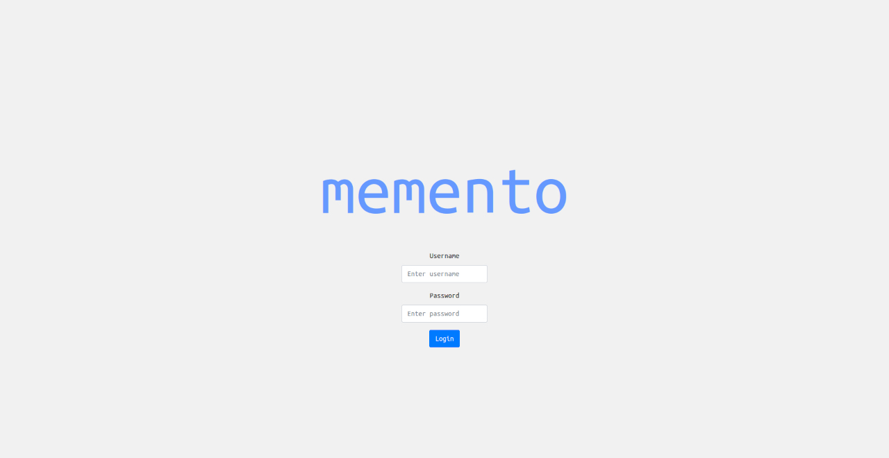

On success you are redirected to the home dashboard.

#### Home dashboard

The home page (`/memento/`) presents two areas:

- **Work on your projects** — lists every project you have been granted access to. The grid icon next to each project name opens the [Viewer](#93-viewer-and-annotation-flow) for that project.
- **Other actions** — visible only to administrators and project managers:
  - **Users** (system admin only) — opens user management.
  - **Projects** — opens project management.
  - **Share image** — a lightweight quick-share form, independent of any project (see [9.2](#92-project-management-flow)).

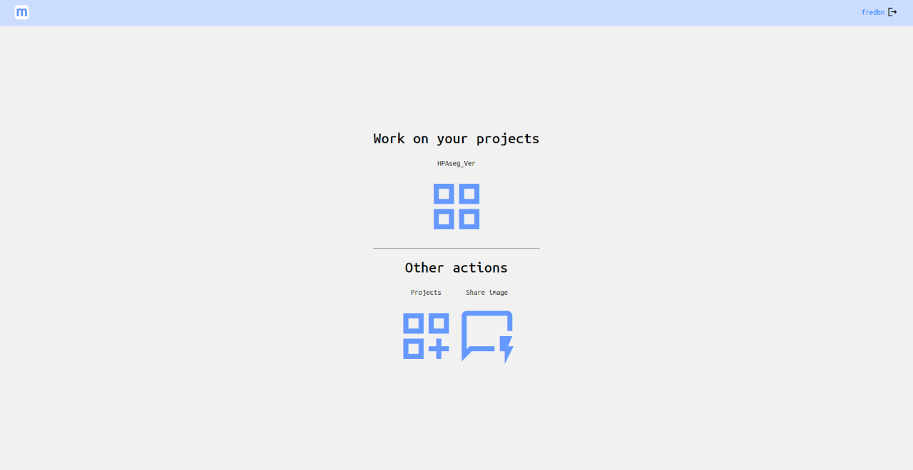

#### Change password

Click your username (top-right corner, visible on every page) to reach the change-password form. All users can change their own password at any time.

#### User management (administrator only)

From Home → **Users**, the manage-users page offers two actions:

- **Manage an existing user** — choose a username from the dropdown and click the icon to open that user's profile. The edit-user page lets you rename the account, reset the password, adjust system-level permissions (`sysadm`, `proadm`), or delete the account entirely.
- **Create a new user** — click the person-add icon to open the new-user form. Only a username and initial password are required.

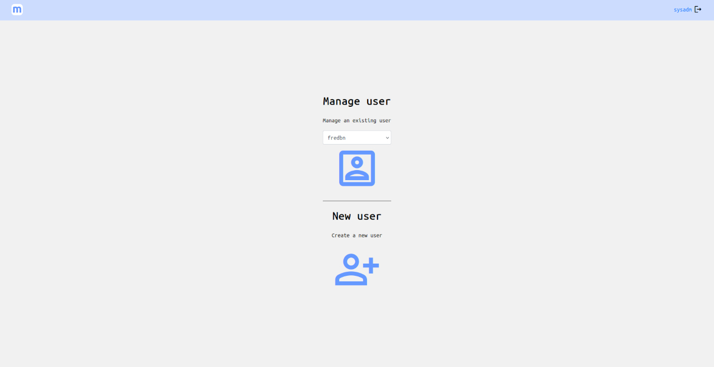

---

### 9.2 Project Management Flow

This flow is used by project owners and system administrators to set up experiments and prepare them for annotators. Regular participants do not see any of these pages.

#### The projects hub

From Home → **Projects**, the manage-projects page lets you:

- **Manage an existing project** — select from the dropdown and click the dashboard icon to open the project editor.
- **Create a new project** — click the customize icon; enter a name and confirm.

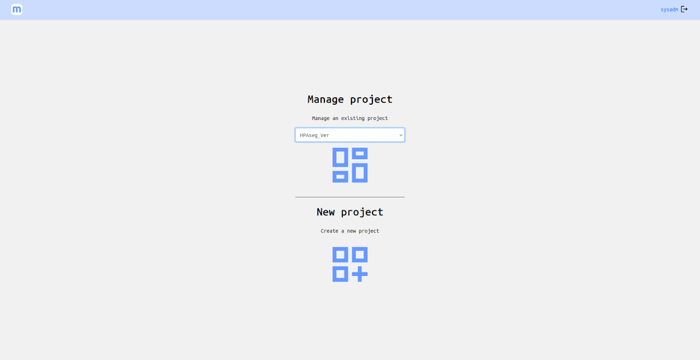

#### The project editor

This is the central management page for a project. It is organized into several sections.

**Edit project**
Rename the project or update its settings string, then click **Update**.

The settings string is a comma-separated list of `key:value` pairs that control viewer behaviour for all annotators on this project. All keys are optional; omit any key to use the default.

| Key | Values | Effect |
|---|---|---|
| `darkmode` | `1` | Canvas starts in dark mode (black background). |
| `clastype` | `i` (default) / `l` | Show the active classification as an **icon** badge in the sidebar (`i`) or a **letter** (`l`). |
| `defaultlayer` | layer sequence number | Pre-selects the given layer when opening any annotation. |
| `expandannotation` | `1` | Label panel slides open automatically on annotation load. |
| `expandclassification` | `1` | Classification panel slides open automatically on annotation load. |
| `expandlayer` | `1` | Layer panel slides open automatically on annotation load. |
| `expandcomment` | `1` | Comment panel slides open automatically on annotation load. |
| `expandcontrols` | `1` | Intensity/transparency controls are expanded by default for every layer. |
| `fastannotation` | `1` | Enables keyboard shortcuts in the label panel: keys `1`–`9` select labels, and submitting automatically advances to the next sample. |
| `annotationexclusive` | `1` | Selecting a label deselects all others (radio-button behaviour). |
| `classificationexclusive` | `1` | Only one classification option can be active at a time. |
| `groupcontrols` | `1` | For annotations with layer groups (z-stack / time-series), intensity and transparency sliders stay in sync across matching channel names in different groups. |

Example: `fastannotation:1,annotationexclusive:1,expandannotation:1,darkmode:1`

**Remove project**
Permanently deletes the project and all its content (categories, annotations, images, layers, comments). A confirmation dialog is shown first.

**Other info**
A live overview of the project, with clickable links to every sub-resource:

| Sub-resource | What you can do here |
|---|---|
| **Participants** | Users who can annotate. Click any name to edit or revoke their access; click **Add participant** to invite a new one. For large projects the list collapses into an autocomplete search field. |
| **Viewers** | Read-only access users (they see the viewer but cannot submit labels). Same add/edit pattern as participants. |
| **Annotation labels** | Short outcome keywords (e.g. `"positive"`, `"artifact"`, `"exclude"`). Click any label to rename or delete it; click **Add label** to create a new one. These appear as buttons in the annotation viewer. |
| **Categories** | Biological groups within the project. Click a category name to enter its editor, where you can also manage the annotations it contains and link classifications to it. Click **Add category** to create one. |
| **Classifications** | Structured scoring options (e.g. `"Grade 1"`, `"Grade 2"`, `"Grade 3"`). Created here at the project level, then linked to specific categories in the category editor. |
| **Images** | The raw image files uploaded to the project. Images are shared across the project — upload once and reuse in multiple annotations. Click **Add image** to upload a new file (with format selection) or register an external URL. |

Below the sub-resource lists, counters show: total participants, total annotations, submitted annotations, and shared annotations — a quick health check on annotation progress.

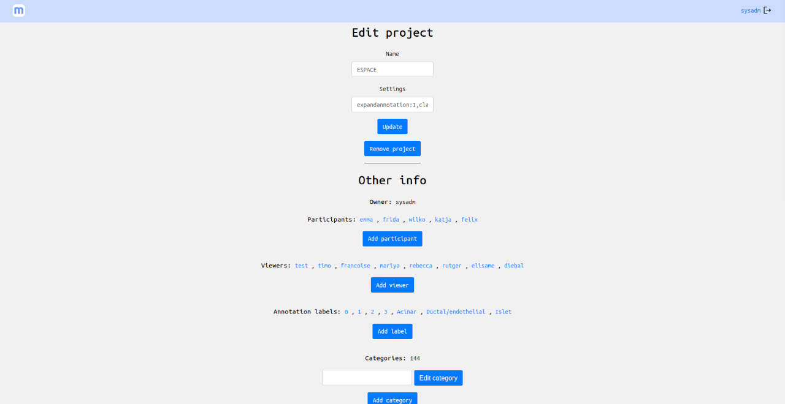

**Export**
At the bottom of the project editor, one-click export buttons are available — no scripting required:

| Data | Format | Contents |
|---|---|---|
| Annotation data | CSV or JSON | One row per annotation: project, category, classification, annotation name, image, status (`N`/`S`), label, image URI |
| Comments | JSON | All layer comments across the project |
| ROIs | JSON | All drawn regions of interest in Fabric.js format |

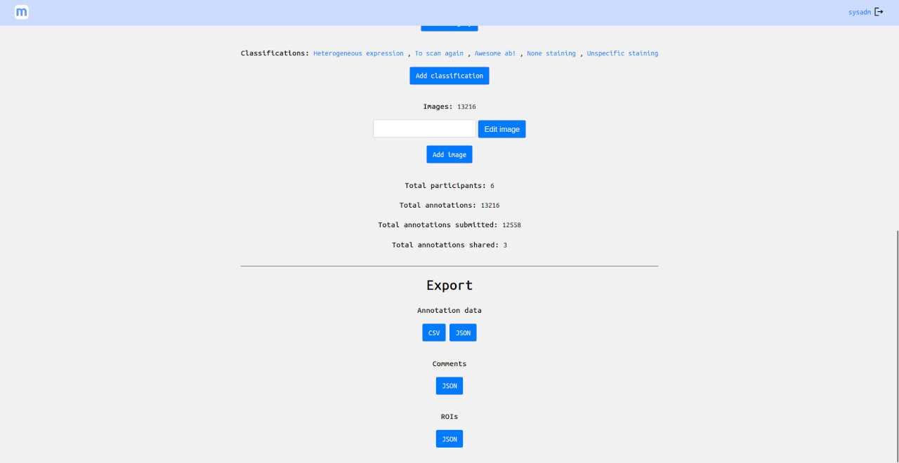

#### Category editor

Reached by clicking any category name in the project editor. Here you can:

- Rename the category.
- Update the category's settings string. Category settings use the same `key:value` comma-separated format as project settings, but apply only to the thumbnail grid view for that category:

  | Key | Values | Effect |
  |---|---|---|
  | `forcerow` | integer | Forces exactly N thumbnails per row in the image grid. |
  | `names` | `hidden` | Hides annotation name labels below thumbnails. |
  | `darkmode` | `1` | Thumbnail grid area starts in dark mode (overrides the project-level setting). |

- Link one or more **classifications** to it — these become the scoring buttons annotators see when this category is active in the viewer.
- Browse and manage **annotations**: add new ones (specifying an image and initial layer), edit existing ones (rename, reassign), or delete them.

#### Quick image sharing

From Home → **Share image**, the `ft_share_image` form lets you share a single image without creating a project:

- Enter a display name.
- Upload a file (with format choice) **or** paste a remote URL.
- Click **Share**. A progress bar tracks the upload, then a processing indicator appears while the server tiles the image. On completion, a shareable link is displayed.

This is useful for quickly sharing a microscopy image with a collaborator without any project overhead.

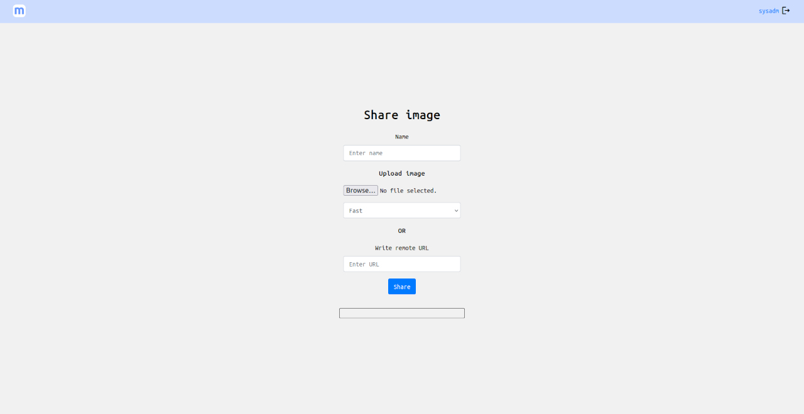

---

### 9.3 Viewer and Annotation Flow

This is the page annotators spend most of their time on. It is reached from the home dashboard by clicking the **grid icon** next to a project name. The viewer is a single-page application — switching between categories and annotations never triggers a full page reload.

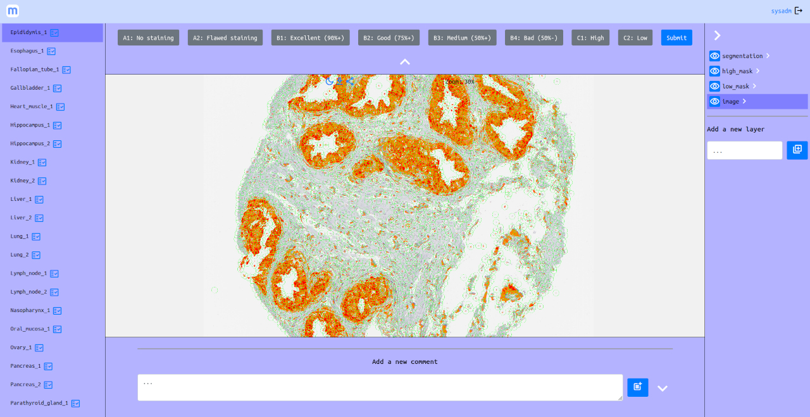

The viewer has four persistent zones:

```
┌─────────────────────────────────────────────────────────────┐
│  Navbar  (logo · username · logout)                         │
├─────────────────────────────────────────────────────────────┤
│  [Label / classification panel]  ← top, collapsible        │
├──────────┬──────────────────────────────┬───────────────────┤
│  Left    │      Central canvas          │  Right layer panel│
│ sidebar  │  (image or thumbnail grid)   │  (collapsible)    │
├──────────┴──────────────────────────────┴───────────────────┤
│  [Comment panel]  ← bottom, collapsible                     │
└─────────────────────────────────────────────────────────────┘
```

#### Left sidebar — navigation

The sidebar lists all categories you have access to. Clicking a category:

- Highlights it in the sidebar.
- Loads a **thumbnail grid** of that category's annotations into the central area.
- Expands an annotation sub-list beneath the category name (loaded on demand).

Each annotation entry in the expanded sub-list can carry three status badges:

| Badge | Meaning |
|---|---|
| `fact_check` icon | The annotation has project labels defined but has not been submitted yet. |
| `notes` icon | The annotation has at least one comment on any of its layers. |
| `share` icon | A temporary anonymous share link is currently active for this annotation. |

The **Next** button at the top of the sidebar advances automatically through annotations that still need labelling (those with the `fact_check` badge). This lets annotators work through a batch without any manual navigation.

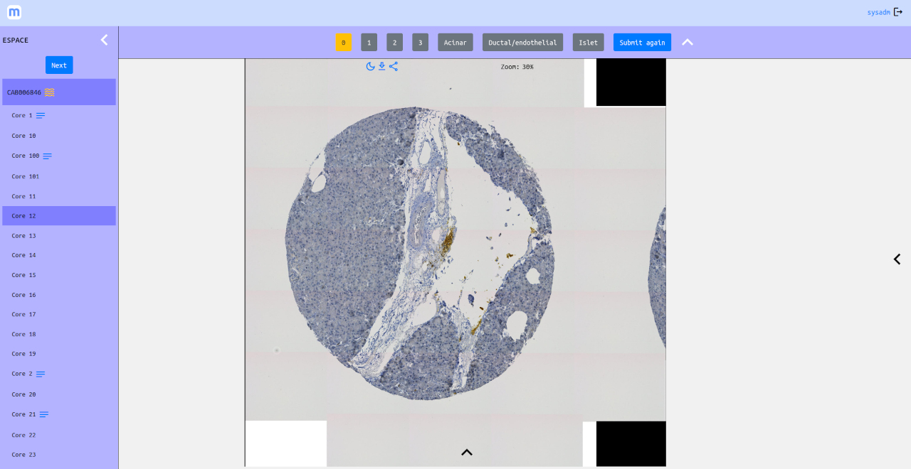

#### Thumbnail grid (category view)

When a category is selected but no individual annotation is active yet, the central area shows a thumbnail grid — one card per annotation, showing a preview image and the annotation name. Click any card to load that annotation into the canvas.

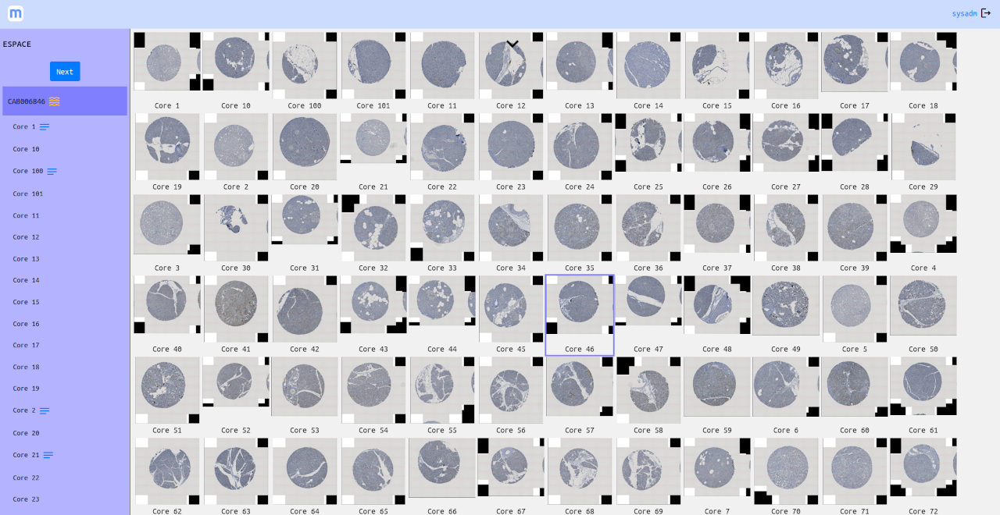

#### Image canvas (annotation view)

Clicking a thumbnail (or a sidebar entry) loads the annotation. The canvas is powered by WebGL via Fabric.js. Basic navigation:

- **Pan**: click and drag anywhere.
- **Zoom**: scroll wheel. The current zoom level is shown in the floating info indicator (top right of the canvas area).
- **Large (pyramidal) images**: tiles are fetched and composited progressively as you zoom in. A "Retexturing…" label appears briefly while replacement tiles load at higher resolution.

Floating action buttons appear at the top right of the canvas:

| Icon | Action |
|---|---|
| `draw` | Activate draw mode for ROI annotation (becomes amber when active; only visible when a drawing layer is selected). |
| `save` | Save the current drawing layer to the server (visible only while draw mode is active). |
| `dark_mode` | Toggle the canvas background between light grey and black — useful when viewing fluorescence channels on a dark background. |
| `download` | Export the current canvas view as a PNG image. |
| `share` | Generate (or revoke) a temporary anonymous share URL for this annotation. Turns amber when a share is active. |
| `link` | Copy the share URL to the clipboard; opens a dialog confirming the URL was copied. Appears only when a share is active. |

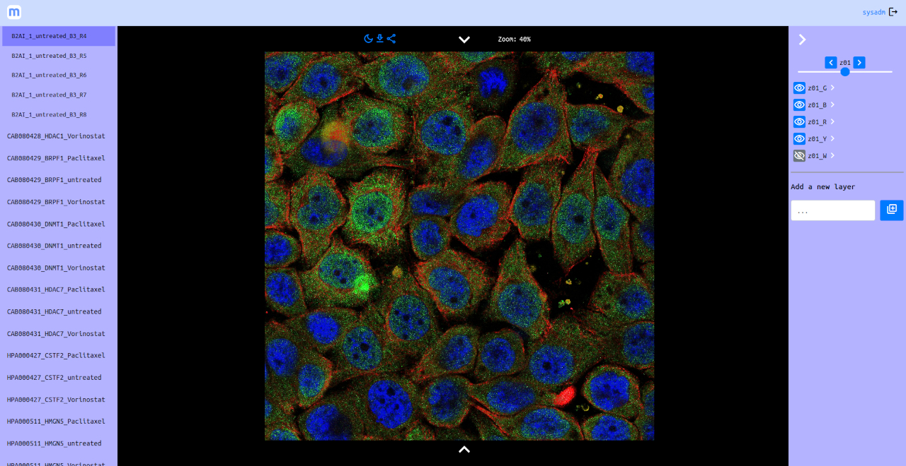

#### Layer panel (right side)

Click the **←** arrow on the right edge of the canvas to open the layer panel. The panel lists every layer in the current annotation.

**Image layers** (associated with an uploaded image):

- **Eye icon** — toggle layer visibility. The icon turns grey and shows `visibility_off` when hidden.
- **Layer name** — click to select this as the active layer for ROI drawing and comments.
- **Notes icon** — appears when the layer has at least one comment.
- **Expand arrow** — opens per-layer display controls:
  - **Auto-adjust** (exposure icon) — computes the 1st–99th percentile of pixel values from a canvas sample and applies optimal brightness/contrast automatically.
  - **Intensity range slider** — dual-handle slider for black-point and white-point clipping. Min and max values can also be typed directly into the adjacent input fields.
  - **Transparency slider** — sets layer opacity from 0 to 100 %. Type a value directly or drag the slider.

**Drawing layers** (annotation canvases without an image):

- Listed at the top of the layer list.
- **Eye icon** — show/hide the drawing canvas overlay.
- **Delete** (red `layers_clear` icon) — permanently removes the layer and all its ROI data after a confirmation prompt. Only the layer owner can delete.
- Selecting a drawing layer activates the draw controls in the canvas floating actions.

**Layer groups** (z-stacks or time-series):

When an annotation has multiple layer groups (e.g. different z-planes), **← / → navigation buttons** and a **slider** appear in the layer panel, letting you step through groups. If group-controls mode is on, intensity and transparency sliders stay synchronized across matching channel names in different groups.

**Layer settings**: each image layer has its own settings string (set via the layer editor in the admin flow). The one active key is:

| Key | Values | Effect |
|---|---|---|
| `bitDepth` | integer (e.g. `8`, `12`, `16`) | Bit depth of the channel as a power of 2. Sets the intensity slider maximum to 2ⁿ−1 (255 for 8-bit, 4095 for 12-bit, 65535 for 16-bit). Defaults to 8-bit if omitted. |

**Adding a drawing layer**: at the bottom of the panel, type a name in the input field and click the add icon (`library_add`). The new drawing canvas is created immediately and added to the canvas stack.

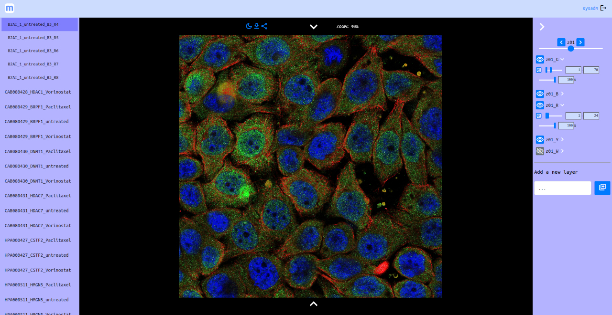

#### Label panel and submission

If the project has **annotation labels** defined, a collapsible bar appears above the canvas. Each label is a toggle button:

- **Grey** — not selected.
- **Amber / yellow** — selected.

Click any label to toggle it. When the project is configured for **exclusive labelling**, selecting a label automatically deselects any previously active one.

Click **Submit** to record your choices and mark the annotation as reviewed (status `S`). The button briefly flashes green on success and the annotation is removed from the Next queue.

**Fast annotation mode** (optional, configured per-project): the number keys `1`–`9` map to the first nine labels. Pressing a number key selects that label, submits, and advances to the next unannotated sample automatically — useful for rapid scoring of large batches.

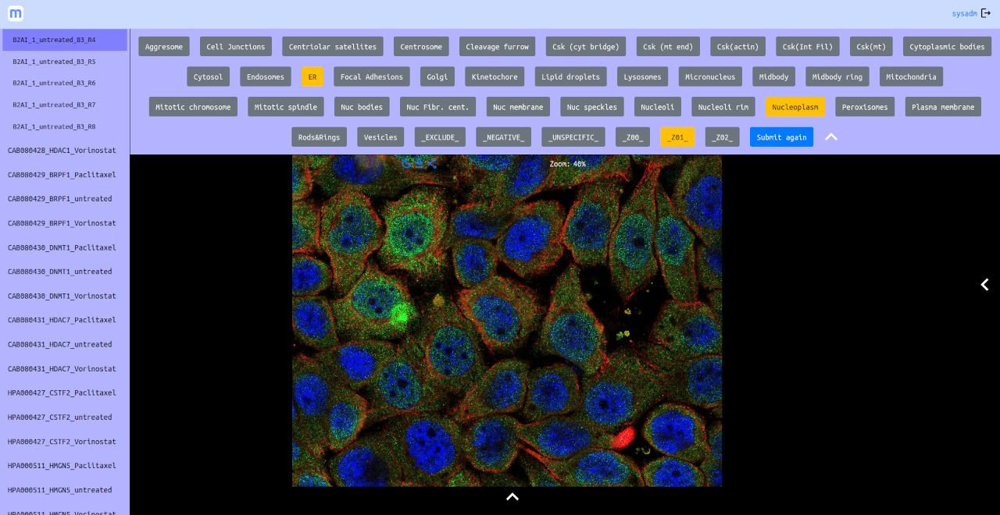

#### Classification panel

If the active category has **classifications** linked to it, the top panel shows classification buttons instead of (or alongside) labels. Select one or more options and click **Classify** to record the score. The sidebar reflects the current classification with a small icon or letter badge next to the category name, so you can scan the score distribution at a glance without opening individual annotations.

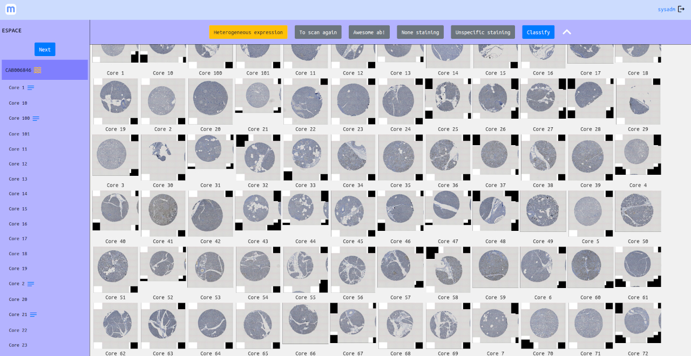

#### Drawing ROIs

To draw a region of interest on a sample:

1. In the layer panel, click a **drawing layer** (no image icon, listed at the top). The layer becomes highlighted.
2. Click the **draw** icon in the floating action bar — it turns amber to confirm draw mode is active.
3. A **colour picker** and a **Fill** checkbox appear in the sub-actions area. Choose your stroke and fill settings.
4. Click on the canvas to lay down polygon vertices. The shape closes when you click back on the first point (a small circle marks the starting vertex).
5. Click the **save** icon to persist the ROI geometry to the server.

Completed ROIs appear in a small table at the top right of the canvas (index and a select icon). Clicking a row focuses that ROI on the canvas. Selecting a shape on canvas exposes a **red delete control** (×) at its corner.

Drawn ROIs can be exported later as JSON via the project editor or via the Python client (`project_rois()`).

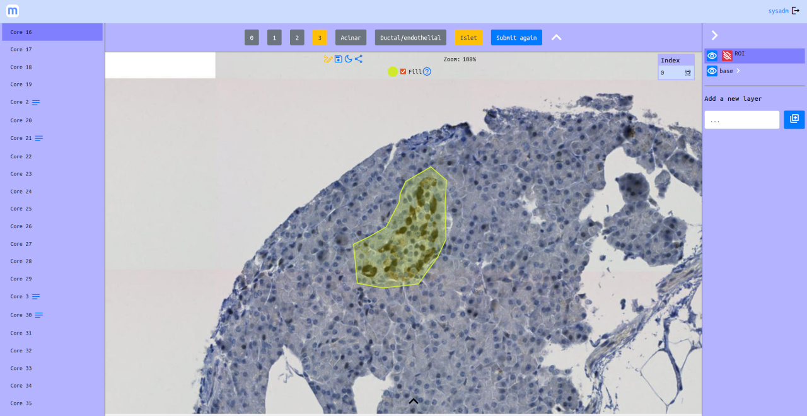

#### Comments

Click the **↑** expand arrow at the bottom edge of the canvas to open the comment panel. Comments are **per-layer** — the panel reloads automatically when you select a different layer from the layer panel.

- **Edit** (pencil icon) — update the text of one of your own comments.
- **Delete** (speaker-notes-off icon) — permanently remove one of your own comments after a confirmation prompt.
- **Add a new comment** — type in the text area and click the add icon (`post_add`). The comment appears in the panel immediately and the notes badge activates on the layer name and on the annotation entry in the sidebar.

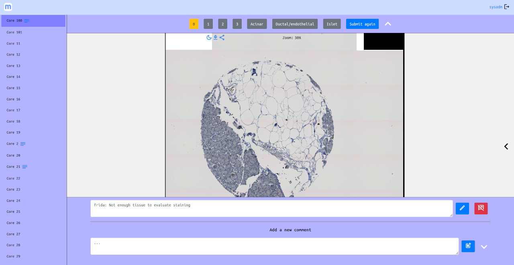

#### Sharing a single annotation

Click the **share** icon in the canvas floating actions to generate a temporary anonymous URL for the current annotation. The icon turns amber. Click the **link** icon to copy the URL and see it in a confirmation dialog — paste it into an email or message to give someone view-only access with no login required.

Recipients who open the link see a stripped-down `viewer_limited` page for that single annotation: the image canvas, the layer panel (read-only), and any existing comments are visible, but they cannot submit labels or edit anything.

Clicking the share icon again revokes the URL — the share badge in the sidebar disappears.
